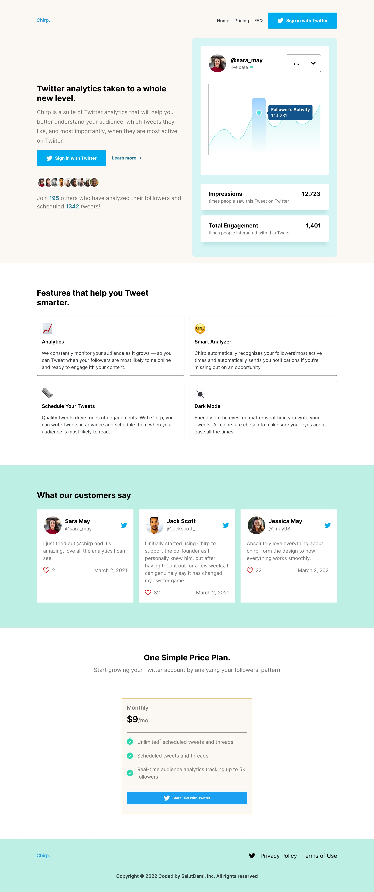
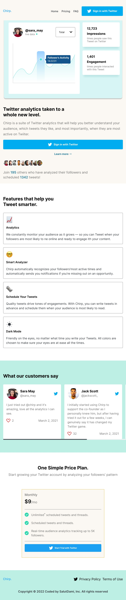
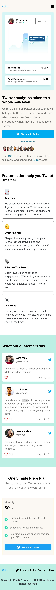

## Table of contents

- [Overview](#overview)
  - [The challenge](#the-challenge)
  - [Screenshot](#screenshot)
  - [Links](#links)
- [My process](#my-process)
  - [Built with](#built-with)
  - [What I learned](#what-i-learned)
  - [Continued development](#continued-development)
  - [Useful resources](#useful-resources)
- [Author](#author)

## Overview

### The challenge

The users will be able to:

- View the optimal layout for the site depending on their device's screen size.
- The hover states will be seen fro all interective elements on the page.

### Screenshot


_A screen shot showing the desktop view_



_A view of the landing page on a tablet_



_A view of the landing page on a medium sized phone_

### Links

- Solution URL: [Add solution URL here](https://github.com/salutDami/Chirp-Landing-Page)
- Live Site URL: [Add live site URL here](https://salutdami.github.io/Chirp-Landing-Page/)

## My process

### Built with

- Semantic HTML5 markup
- CSS custom properties
- Flexbox
- Grid
- Mobile First approach

### What I learned

This project was done by applying a mobile first workflow which I haven't attepmted before now and after this I think I will be going for the approach more often. I alos continued working with the clamp property ton make mu spacing and my typography fluid and respond to the view port as well. Using CSS I was able to manipulate the navigation area to make it look good on mobile, tablet and desktop. Hamburger menus was used for the mobile navigation.

You can see a snippet of how I was able to achieve that below:

```html
<header class="header">
  <div class="container header_content">
    <a href="#" class="img_logo">
      
    </a>
    <nav class="nav">
      <ul class="nav_list">
        <li class="nav_list_item">
          <a href="#Home" class="nav_link">Home</a>
        </li>
        <li class="nav_list_item">
          <a href="#Pricing" class="nav_link">Pricing</a>
        </li>
        <li class="nav_list_item">
          <a href="#FAQ" class="nav_link">FAQ</a>
        </li>
        <li class="nav_list_item">
          <a href="#SignIn" class="nav_link nav_link_cta">
            
            <span>Sign in with Twitter</span>
          </a>
        </li>
      </ul>
    </nav>

    <button type="button" class="btn btn_action">
      <!-- <svg
        width="24"
        height="20"
        viewBox="0 0 24 20"
        fill="none"
        xmlns="http://www.w3.org/2000/svg"
      >
        <path
          d="M24 4H0V0H24V4ZM24 8H0V12H24V8ZM24 16H0V20H24V16Z"
          fill="black"
        />
      </svg> -->
    </button>
  </div>
</header>
```

```css
.header {
  padding-top: var(--space-6-7);
  padding-bottom: var(--space-5-6);
  background-color: var(--pale-yellow);
  position: fixed;
  top: 0;
  left: 0;
  width: 100%;
  z-index: 90;
}

.header_content {
  display: flex;
  align-items: center;
  justify-content: space-between;
}

.nav {
  margin-left: auto;
  position: absolute;
  top: 0;
  left: 0;
  max-width: 50rem;
  width: 100%;
  height: 100vh;
  background-color: var(--pale-yellow);
  z-index: 90;
  transform: translateX(100%);
  pointer-events: none;
  visibility: hidden;
  transition: all 0.32s;
  opacity: 0;
}

.nav.active {
  transform: translateX(0);
  visibility: visible;
  pointer-events: auto;
  opacity: 1;
}

.nav_list {
  display: flex;
  flex-direction: column;
  justify-content: center;
  align-items: center;
  gap: 20px;
}

.nav_list_item {
  list-style-type: none;
}

.nav_link:is(:link, :visited) {
  display: inline-block;
  text-decoration: none;
  color: var(--gray);
  font-weight: var(--fw-500);
  font-size: var(--fs-8);
  transition: all 0.4s;
  cursor: pointer;
}

.nav_link:is(:hover, :active, :focus) {
  color: var(--blue-2);
}

.nav_logo {
  display: inline-block;
}

.nav_link.nav_link_cta:is(:link, :visited) {
  display: flex;
  color: var(--white);
  background-color: var(--blue-1);
  border-radius: var(--radius);
  font-weight: var(--fw-700);
  font-size: var(--fs-8);
  padding: var(--space-4) var(--space-6);
  gap: 10px;
  cursor: pointer;
  transition: all 0.4s;
}

.nav_link.nav_link_cta:is(:hover, :active, :focus) {
  background-color: var(--hover-blue-1);
}

.btn {
  cursor: pointer;
  display: block;
  background: none;
  border: none;
  transition: all 0.4s;
}

.btn:is(:hover, :active, :focus) {
  opacity: 0.6;
}
```

### Continued development

For my development, I will be carrrying out more projects to improve my CSS and the knowledge of Javascript will also be needed to some functionality of the menu toggle button and this will be done in the future.

### Useful resources

- [Julio Codes](https://www.youtube.com/watch?v=E1ZjV2oVTY0&t=2997s) - This youtube channel was where I learnt how to make the nav toggle button and style it for this project.

- [w3schools](https://w3schools.com) - This was where I also got to know about the display:inline-flex property as I needed that propety for the buttons in the nav, hero and price plan section. The display:flex property was alos used when carrying the mobile version for the button as well.

## Author

- Twitter - [@\_salutDami](https://www.twitter.com/_salutDami)
- Linkedin- [Ikuomola Stephen](https://www.linkedin.com/in/ikuomola-stephen/)
